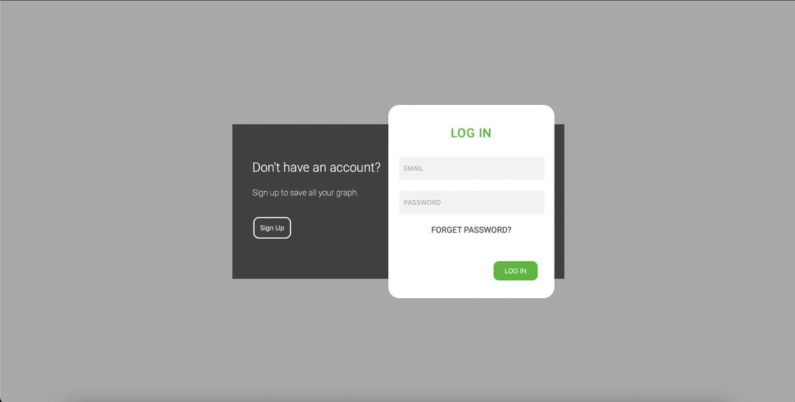

# Layout of the login form
1. Create a login form using a picture

2. The form is responsive and works for screen sizes from 320px to 600px and 600px to 1600px.

3. Used the Perfect Pixel extension for exact image matching.

[Perfect Pixel](https://chrome.google.com/webstore/detail/perfectpixel-by-welldonec/dkaagdgjmgdmbnecmcefdhjekcoceebi?hl=ru)
